# 🎓 SETGuru: Socratic Emphatic Tutor Guru

<div align="center">


*An innovative AI-powered learning companion that guides students through personalized Socratic questioning and emotional intelligence*

[🚀 Quick Start](#-quick-start) • [📖 Documentation](#-architecture) • [🤝 Contributing](#-contributing) • [📝 License](#-license)

</div>

## 📋 Table of Contents

- [Overview](#-overview)
- [Features](#-features)
- [Architecture](#-architecture)
- [Quick Start](#-quick-start)
- [Configuration](#-configuration)
- [Development](#-development)
- [API Documentation](#-api-documentation)
- [Troubleshooting](#-troubleshooting)
- [Contributing](#-contributing)
- [License](#-license)

## 🌟 Overview

SETGuru transforms the learning experience by combining the power of **Socratic questioning** with **emotional intelligence**. Instead of providing direct answers, our AI tutor guides students to discover solutions independently, adapting its approach based on their emotional state and learning style.

### 🏗️ Tech Stack

| Component | Technology | Purpose |
|-----------|------------|---------|
| **Frontend** | Next.js (React) | Modern, responsive UI |
| **API Gateway** | Node.js + Express | User data & routing |
| **AI Service** | Python + FastAPI | LLM integration & AI logic |
| **Database** | PostgreSQL | Persistent data storage |
| **Orchestration** | Docker Compose | Containerized deployment |
| **AI Models** | Google Gemini / OpenAI GPT | Large Language Models |

## ✨ Features

### 🧠 Core Learning Features
- **🔍 Socratic Questioning**: AI never gives direct answers, but guides through thoughtful questions
- **💭 Emotional Intelligence**: Detects emotions and adapts teaching style accordingly
- **📊 Progress Tracking**: Visual learning analytics and concept mastery tracking
- **🎯 Personalized Learning**: Adapts to subject, grade level, and learning preferences

### 🎮 Gamification
- **🏆 Achievement System**: Badges and rewards for consistent learning
- **🔥 Streak Counters**: Motivation through daily learning streaks
- **📈 Progress Visualization**: Interactive charts and learning metrics

### 🛠️ Technical Features
- **🔌 Pluggable AI Models**: Easy switching between LLM providers
- **💬 Real-time Chat**: Modern messaging interface
- **🐳 Containerized**: Full Docker setup for easy deployment
- **🔧 Configurable**: Environment-based configuration system

## 🏗️ Architecture

```mermaid
graph TB
    subgraph Client["Client Layer"]
        A["👤 User"]
    end
    
    subgraph Frontend["Frontend Layer"]
        B["🖥️ Next.js Frontend<br/>Port: 3000"]
    end
    
    subgraph Backend["Backend Layer"]
        C["🚀 Node.js API Gateway<br/>Port: 3001"]
        D["🐍 Python AI Service<br/>Port: 8000"]
    end
    
    subgraph Data["Data Layer"]
        E["🗄️ PostgreSQL Database<br/>Port: 5432"]
        F["📦 Docker Volumes"]
    end
    
    subgraph External["External Services"]
        G["🤖 Google Gemini / OpenAI GPT"]
    end
    
    A --> B
    B -->|HTTP/REST| C
    C -->|HTTP/REST| D
    C -->|SQL| E
    D -->|API Calls| G
    E -->|Persistent Storage| F
```



## 🚀 Quick Start

### 📋 Prerequisites

Before you begin, ensure you have the following installed:

- [Git](https://git-scm.com/) - Version control
- [Docker Desktop](https://www.docker.com/products/docker-desktop/) - Container platform
- [Google AI API Key](https://ai.google.dev/) - For Gemini models

### 1️⃣ Clone the Repository

```bash
git clone https://github.com/yourusername/setguru-chatbot-dev.git
cd setguru-chatbot-dev
```

### 2️⃣ Environment Setup

Create your environment configuration:

```bash
cp .env.example .env
```

Edit the `.env` file with your configuration:

```bash
# 🔧 Backend Configuration
NODEJS_BACKEND_PORT=3001
TEMP_USER_ID=                    # ⚠️ REQUIRED: See step 4

# 🗄️ Database Configuration
DB_USER=setguru_user
DB_PASSWORD=your_strong_password  # ⚠️ REQUIRED: Choose a strong password
DB_NAME=setguru_db
DB_PORT=5432

# 🐍 AI Service Configuration
PYTHON_AI_SERVICE_PORT=8000
GOOGLE_API_KEY=YOUR_API_KEY      # ⚠️ REQUIRED: Get from Google Cloud Console
OPENAI_API_KEY=                  # 🔧 Optional: For OpenAI models

# 🤖 LLM Provider Selection
LLM_PROVIDER=google              # Options: 'google' or 'openai'
```

> ⚠️ **Security Note**: Never commit your `.env` file to version control!

### 3️⃣ Launch the Application

```bash
docker compose up --build
```

### 4️⃣ Initialize Database User

After the first launch, get your test user ID:

```bash
docker compose exec db psql -U setguru_user -d setguru_db -c "SELECT id FROM users WHERE email = 'testuser@example.com';"
```

Copy the UUID and update your `.env` file:

```bash
TEMP_USER_ID=your-copied-uuid-here
```

Restart the services:

```bash
docker compose down
docker compose up
```

### 5️⃣ Access Your Application

| Service | URL | Description |
|---------|-----|-------------|
| 🖥️ **Frontend** | http://localhost:3000 | Main application interface |
| 🚀 **API Gateway** | http://localhost:3001/api | Backend API endpoints |
| 🐍 **AI Service** | http://localhost:8000 | AI service API (internal) |

## ⚙️ Configuration

### 🔧 Environment Variables

| Variable | Required | Default | Description |
|----------|----------|---------|-------------|
| `NODEJS_BACKEND_PORT` | No | 3001 | Node.js backend port |
| `PYTHON_AI_SERVICE_PORT` | No | 8000 | Python AI service port |
| `TEMP_USER_ID` | **Yes** | - | Temporary user ID for testing |
| `DB_PASSWORD` | **Yes** | - | PostgreSQL password |
| `GOOGLE_API_KEY` | **Yes** | - | Google Gemini API key |
| `OPENAI_API_KEY` | No | - | OpenAI API key (if using OpenAI) |
| `LLM_PROVIDER` | No | google | LLM provider (`google` or `openai`) |

### 🎯 LLM Provider Configuration

#### Google Gemini Setup
1. Visit [Google AI Studio](https://ai.google.dev/)
2. Create a new API key
3. Set `LLM_PROVIDER=google` in your `.env`
4. Add your key as `GOOGLE_API_KEY`

#### OpenAI Setup
1. Visit [OpenAI Platform](https://platform.openai.com/)
2. Create an API key
3. Set `LLM_PROVIDER=openai` in your `.env`
4. Add your key as `OPENAI_API_KEY`

## 💻 Development

### 🔄 Common Commands

```bash
# Start all services
docker compose up

# Start with rebuild
docker compose up --build

# Stop all services
docker compose down

# Stop and remove volumes (clean slate)
docker compose down -v

# View all logs
docker compose logs

# View specific service logs
docker compose logs nodejs-backend
docker compose logs python-ai-service
docker compose logs frontend

# Check service status
docker compose ps
```

### 🐛 Development Workflow

1. **Make code changes** in `studio/`, `new-nodejs-backend/`, or `new-python-ai-service/`
2. **Rebuild affected services**:
   ```bash
   docker compose up --build [service-name]
   ```
3. **Test your changes** using the frontend or API endpoints
4. **Check logs** for any issues:
   ```bash
   docker compose logs [service-name]
   ```

### 📁 Project Structure

```
setguru-chatbot-dev/
├── 📂 studio/                    # Next.js frontend
├── 📂 new-nodejs-backend/        # Express.js API gateway
├── 📂 new-python-ai-service/     # FastAPI AI service
├── 📂 db-init/                   # Database initialization scripts
├── 🐳 docker-compose.yml         # Docker orchestration
├── 📝 .env                       # Environment configuration
└── 📖 README.md                  # This file
```

## 📚 API Documentation

### 🚀 Node.js Backend Endpoints

| Method | Endpoint | Description |
|--------|----------|-------------|
| `GET` | `/api/user-data` | Get user information |
| `POST` | `/api/chat` | Send message to AI tutor |
| `GET` | `/api/progress` | Get learning progress |

### 🐍 Python AI Service Endpoints

| Method | Endpoint | Description |
|--------|----------|-------------|
| `POST` | `/ai/analyze-emotion` | Analyze student emotion |
| `POST` | `/ai/generate-response` | Generate Socratic response |
| `POST` | `/ai/assess-understanding` | Assess student understanding |

### 📝 Example API Calls

```bash
# Test user data endpoint
curl http://localhost:3001/api/user-data

# Test emotion analysis
curl -X POST http://localhost:8000/ai/analyze-emotion \
  -H "Content-Type: application/json" \
  -d '{"message": "I am really frustrated with this math problem"}'
```

## 🔧 Troubleshooting

<details>
<summary>🐳 Docker Issues</summary>

**Problem**: Docker containers won't start
```bash
# Solution: Clean Docker system
docker system prune -a
docker compose down -v
docker compose up --build
```

**Problem**: Port already in use
```bash
# Solution: Change ports in .env file
NODEJS_BACKEND_PORT=3002
PYTHON_AI_SERVICE_PORT=8001
```
</details>

<details>
<summary>🗄️ Database Issues</summary>

**Problem**: Database connection failed
```bash
# Solution: Reset database
docker compose down -v
docker compose up --build
```

**Problem**: Missing TEMP_USER_ID
```bash
# Solution: Get user ID from database
docker compose exec db psql -U setguru_user -d setguru_db -c "SELECT id FROM users WHERE email = 'testuser@example.com';"
```
</details>

<details>
<summary>🤖 AI Service Issues</summary>

**Problem**: AI responses not working
- Check your `GOOGLE_API_KEY` is valid
- Verify `LLM_PROVIDER` is set correctly
- Check API service logs: `docker compose logs python-ai-service`

**Problem**: Rate limiting
- Implement request throttling
- Consider upgrading your API plan
</details>

## 🗺️ Roadmap

### 🎯 Phase 1: Core Features
- [x] Socratic questioning engine
- [x] Emotional intelligence detection
- [x] Basic chat interface
- [ ] Enhanced progress tracking

### 🚀 Phase 2: Advanced Features
- [ ] User authentication system
- [ ] Real-time WebSocket communication
- [ ] Advanced analytics dashboard
- [ ] Mobile app development

### 🌟 Phase 3: Scale & Polish
- [ ] Multi-language support
- [ ] Advanced AI model fine-tuning
- [ ] Comprehensive testing suite
- [ ] Production deployment guides

## 🤝 Contributing

We welcome contributions! Here's how to get started:

### 🔄 Development Process

1. **Fork** the repository
2. **Create** a feature branch: `git checkout -b feature/amazing-feature`
3. **Make** your changes
4. **Test** thoroughly
5. **Commit** your changes: `git commit -m 'Add amazing feature'`
6. **Push** to your branch: `git push origin feature/amazing-feature`
7. **Create** a Pull Request

### 📝 Contributing Guidelines

- Follow the existing code style
- Add tests for new features
- Update documentation as needed
- Ensure Docker builds pass
- Write meaningful commit messages

### 🐛 Bug Reports

Found a bug? Please create an issue with:
- Clear description of the problem
- Steps to reproduce
- Expected vs actual behavior
- Your environment details

## 📄 License

This project is licensed under the MIT License - see the [LICENSE](LICENSE) file for details.

## 🙏 Acknowledgments

- Built with ❤️ by the SETGuru team
- Powered by [Google Gemini](https://ai.google.dev/) and [OpenAI](https://openai.com/)
- Inspired by Socratic teaching methods
- Thanks to all contributors and users

---

<div align="center">

**Made with ❤️ for better learning experiences**

[⭐ Star this repo](https://github.com/yourusername/setguru-chatbot-dev) • [🐛 Report Bug](https://github.com/yourusername/setguru-chatbot-dev/issues) • [💡 Request Feature](https://github.com/yourusername/setguru-chatbot-dev/issues)

</div>